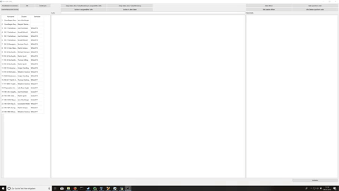

# HTW-Moodle-DMS
Dies ist eine Anwendung, die es den Studenten der HTW-Berlin ermöglicht ihre Kursdateien automatisch in eine hinterlegte Datenbank zu laden. Auf dieser Basis können die Studenten ihre Dateien unter anderem nach Semestern, Kursnamen und Dozenten suchen, öffnen und speichern.

Motivation für die Nutzung der Anwendung
===============================
	
| Mangel im aktuellen Moodlesystem                                                                                                       | Ziel                                                                                                                                                                                   |
|---------------------------------------------------------------------------------------------------------------|----------------------------------------------------------------------------------------------------------------------------------------------------------------------------------------|
| Hoher Suchaufwand, da Dateien meist unklar benannt sind und sich dadurch der Inhalt nicht erschließt.         | * Ermöglichung der Schlagwortsuche für pdf, docx, pptx und html-Dokumente * Ermöglichung der gezielten Suche nach Semester, Dozent oder Vorlesung * Inhaltszusammenfassung der Dateien für pdf, docx, pptx und html-Dokumente |
| Keine Funktion zum automatischen Herunterladen aller Dateien in Moodle.                                       | * Automatisches herunterladen der Daten aus Moodle                                                                                                                                     |
| Eigenständige Organisation der Daten in Ordnern führt zu Verlust von Metainformation bzw. ist sehr aufwändig. | * Speicherung der Dateien und deren Informationen in einer Datenbank                                                                                                                   |
| Hoher Suchaufwand zu einem späteren Zeitpunkt                                                                 | * Ermöglichung der Schlagwortsuche für pdf, docx, pptx und html-Dokumente * Ermöglichung der gezielten Suche nach Semester, Dozent oder Vorlesung * Inhaltszusammenfassung der Dateien für pdf, docx, pptx und html-Dokumente |
| Potentieller Informationsverlust bei Löschung der Kurse nach Semesterende.                                    | * Automatisches herunterladen der Daten aus Moodle                                                                                                                                     |
| Informationsverlust aufgrund des Zugangsverlusts nach Studienende                                             | Automatisches Herunterladen der Daten aus Moodle                                                                                                                                       |

Start und Nutzung des Programms
=========================
Wie das Programm gestartet und genutzt werden kann ist im Dokument „Benutzerhandbuch.pdf“ dokumentiert. Um den Start zu vereinfachen sind im Ordner „Benutzerhilfe“ verschiedene Videos hinterlegt, die zeigen, wie die Funktionen genutzt werden können.

Angedachte Nutzung
===============
Das Programm ist so angedacht, dass einmal oder mehrfach in einem Semester der Downloadprozess von der Moodleplattform initiiert wird. Dies hat zur Folge, dass der einmalige textuelle Aufbereitungsprozess für jede Datei nicht zu einer längeren Wartezeit führt. Auf diese Art und Weise ist zu erwarten, dass pro Semesterwoche ca. eine Datei pro Kurs hinzukommt und im Durchschnitt sechs Kurse belegt sind. Dies führt zu einer Aufbereitung von ca. sechs Dateien pro Woche. Die benötigte Zeit liegt dann ca. bei sechs Minuten.

Genutzte Python-Module 
======================
*  PyQt5 https://www.riverbankcomputing.com/software/pyqt/download5 author: Riverbank Computing Limited
* nltk https://www.nltk.org/ author: Steven Bird
* sqlalchemy https://www.sqlalchemy.org/ author: Mike Bayer
* scrapy https://scrapy.org/ author: Scrapy developers 
* langdetect https://pypi.org/project/langdetect/ author: Michal "Mimino" Danilak
* pdfminer https://pypi.org/project/pdfminer.six/ author: Yusuke Shinyama + Philippe Guglielmetti
* BeautifulSoup https://pypi.org/project/beautifulsoup4/ author: Leonard Richardson
* docx https://python-docx.readthedocs.io/en/latest/ author: Steve Canny
* pptx https://pypi.org/project/python-pptx/ author: Steve Canny
